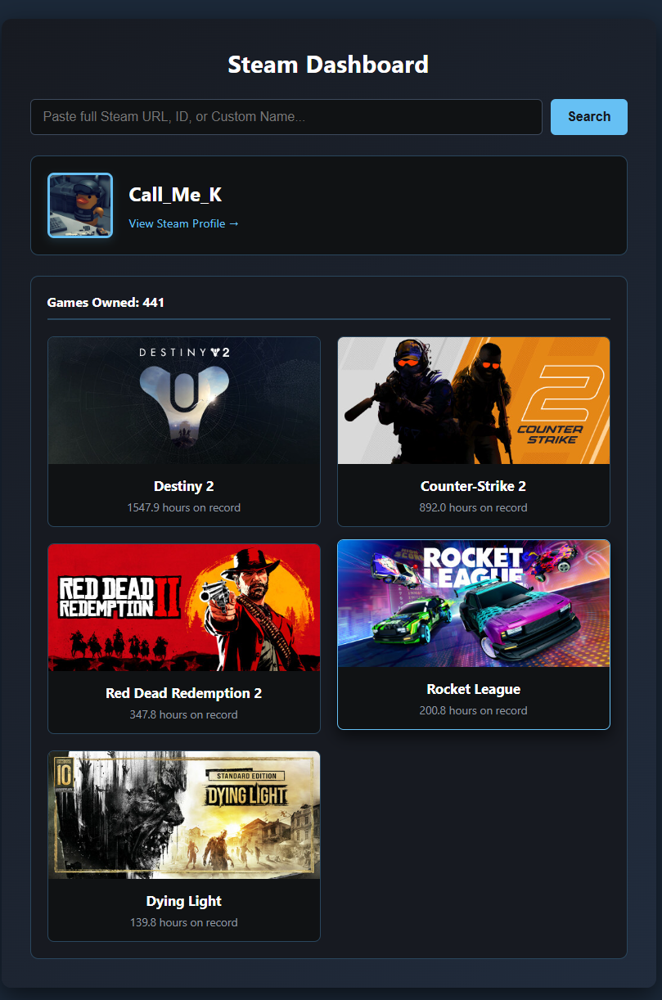

<div align="center">
  
  # 🎮 Steam Profile Dashboard
  
  **A sleek, responsive web application that fetches and visualizes Steam user profiles and game libraries using the official Steam Web API.**

  [](https://www.python.org/)
  [](https://flask.palletsprojects.com/)
  [](https://developer.valvesoftware.com/wiki/Steam_Web_API)
  
</div>

---

## ✨ Features

- **Smart Search:** Paste a 17-digit `SteamID64`, a custom Vanity URL, or even a full Steam profile link—the app figures it out automatically.
- **Profile Overview:** Instantly displays the user's current avatar, display name, and a direct link to their Steam page.
- **Library Visualization:** Transforms raw playtime data into a beautiful, grid-based UI showing the user's Top 5 most played games.
- **High-Res Banners:** Dynamically fetches official Steam store banner images for every game.
- **Privacy Handled:** Gracefully detects and handles users with private game libraries.

## 📸 Sneak Peek

*(Pro-tip: Take a screenshot of your app running, save it as `screenshot.png` in your project folder, and it will appear here!)*



---

## 🛠️ Tech Stack

- **Backend:** Python, Flask, Requests
- **Frontend:** HTML5, CSS3 (CSS Grid, Flexbox), Jinja2 Templating
- **Environment:** `python-dotenv` for secure API key management

---

## 🚀 Getting Started

Follow these instructions to get a copy of the project up and running on your local machine.

### Prerequisites

1. Python 3.x installed on your machine.
2. A **Steam Web API Key**. You can get one for free [here](https://steamcommunity.com/dev/apikey) (requires a non-limited Steam account).

### Installation

1. **Clone the repository**
   ```bash
   git clone [https://github.com/YOUR_GITHUB_USERNAME/steam-dashboard.git](https://github.com/YOUR_GITHUB_USERNAME/steam-dashboard.git)
   cd steam-dashboard
